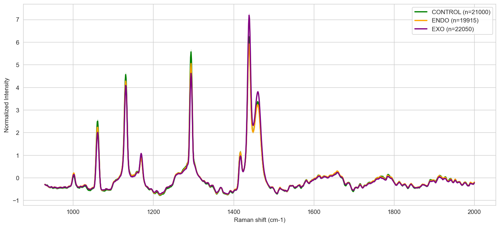
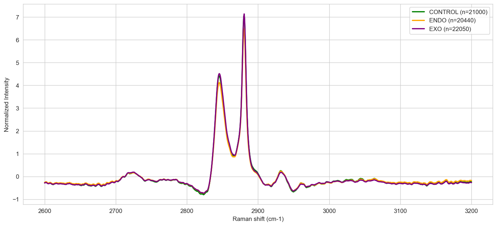
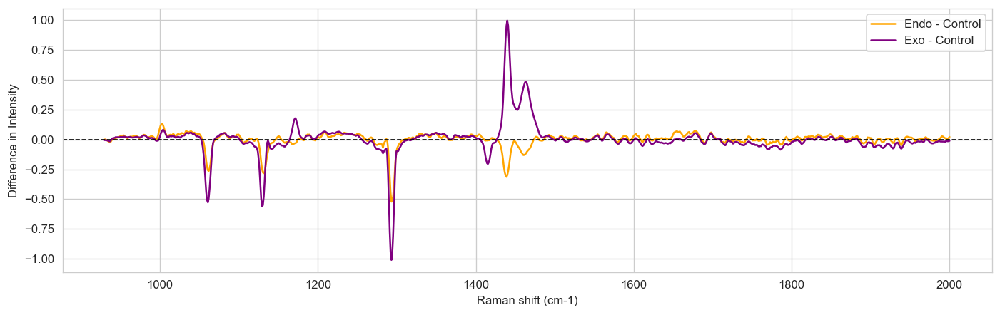
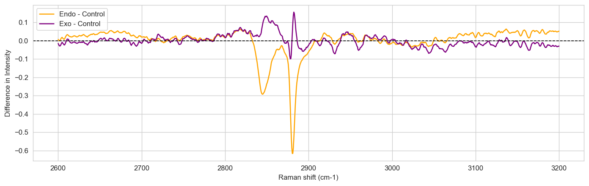
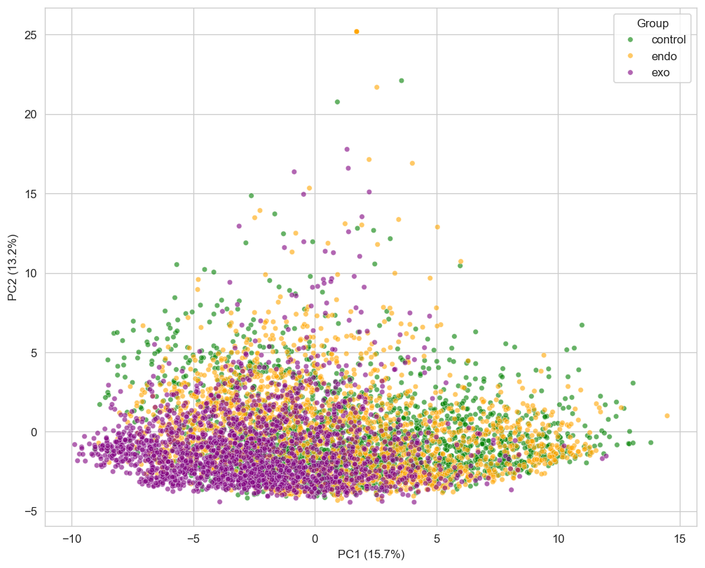
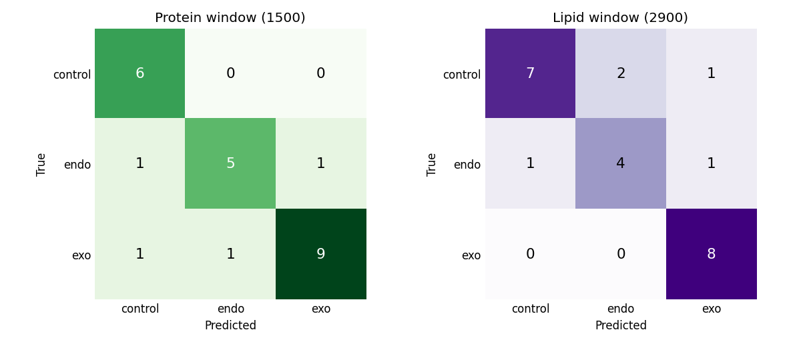
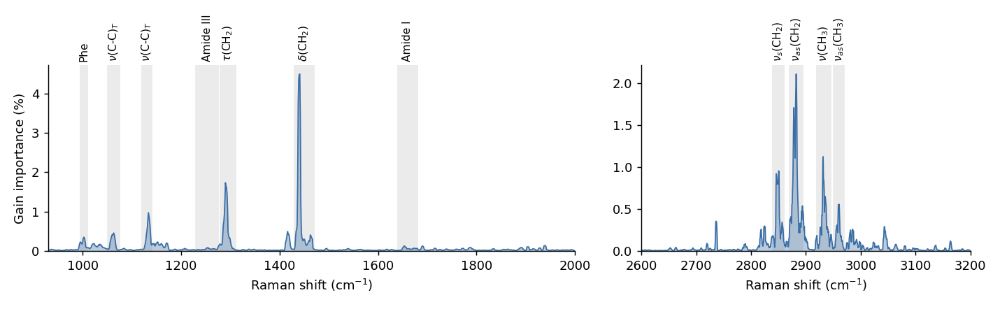

# Brain Tissue Classification from Raman Spectra


[](docs/preprint.pdf)

A machine learning pipeline that reads Raman scans of mouse brain tissue and tells which experimental group a sample belongs to. Built by team **Bokom_m** at the Nuclear IT Hack 2026 hackathon.

**Preprint:** [Raman maps of brain tissue separate HSP70-related stress states: a gradient boosting study with an audit of its own validation](docs/preprint.pdf)

## About

Raman spectroscopy shows the chemical makeup of tissue without damaging it. Every scan is a small map where each pixel has its own spectrum. We used scans of the cortex, striatum and cerebellum to tell apart three groups:

- **Control**: healthy tissue
- **Endo**: tissue under stress, with the cell's own HSP70 response
- **Exo**: tissue from animals that received HSP70 from outside

HSP70 is a heat shock protein that helps cells survive stress and is known to interact with cell membranes. The question behind the project: does its effect leave a trace in the spectrum that a model can pick up?

Scans come in two spectral windows that we treat separately:

- **1500 cm⁻¹** (fingerprint window): proteins, lipids and nucleic acids
- **2900 cm⁻¹** (high wavenumber window): C-H vibrations, mostly lipid chains

## How it works

1. **Resampling.** Every spectrum is put onto the same wavenumber grid.
2. **Cleaning.** ALS baseline correction removes the fluorescence background, a Savitzky-Golay filter smooths out noise, and SNV normalization evens out differences in overall intensity.
3. **Pixel classification.** A LightGBM model predicts the group for every pixel.
4. **Sample diagnosis.** Pixel probabilities are averaged into one answer for the whole sample.

The math behind each step is written out in the [preprint](docs/preprint.pdf).

## What the data looks like

Average spectra of each group after cleaning:

<p>
  
  
</p>

The difference from Control shows where the groups actually diverge:

<p>
  
  
</p>

The differences are subtle, and PCA shows that the groups overlap heavily. That is why we went with gradient boosting instead of a simple linear model.

<details>
<summary>PCA projection (fingerprint window)</summary>

</details>

## Results

Accuracy on held-out samples, with chance at 33%:

| Window | Accuracy |
|---|---|
| Fingerprint (1500) | 83% |
| High wavenumber (2900) | 79% |



The two windows make different mistakes. The 1500 model never missed a healthy sample, and the 2900 model never missed an Exo sample. This hints at a two-step check: screen out healthy tissue with the first window, then tell Endo from Exo with the second.

## What the model looks at



Both models rely mostly on **lipid bands**: CH₂ vibrations near 1440, 1296, 2850 and 2880 cm⁻¹ and C-C stretches of lipid chains near 1062 and 1130 cm⁻¹. Even in the fingerprint window, which is usually called the protein window, protein-specific bands carry only a small part of the decision. Brain tissue is very rich in lipids, and HSP70 is known to bind membranes, so a signature that lives in lipid bands makes biological sense.

## Honest caveats

After the hackathon we looked at our evaluation more critically. The full discussion is in the preprint, the short version:

- **The split is by map, not by animal.** Several maps come from the same mouse, so the model may partly recognise individual animals. Another team that held out whole animals on the same data got much lower scores, so our numbers are best read as an upper bound.
- **The test set was used for early stopping** and for choosing between model variants, which also inflates the score.
- **The test set is small** (24 samples per window), so the uncertainty is large.

The preprint lays out a leakage-free protocol for this data. The bundled `model_1500.pkl` is the regularised variant from the notebook, which scored a bit lower than the base model behind the 83%.

## Quick start

```bash
git clone https://github.com/igor688-hub/Nuclear-IT_Hack.git
cd Nuclear-IT_Hack
pip install -r requirements.txt
python predict.py path/to/scan.txt
```

The script accepts:

- a raw `.txt` export from the microscope with columns `X Y Wave Intensity` and one header line
- a `.csv` with one spectrum per row and wavenumbers as column names

The spectral window is detected automatically. The script prints how the pixels voted and the final diagnosis for the sample, then saves per-pixel predictions next to the input file as `<name>_predictions.csv`.

## Training

Everything from raw scans to saved models is in [`notebooks/model_training.ipynb`](notebooks/model_training.ipynb).

The raw scans are not included in this repository. To retrain, put the `.txt` files into `data/`. File names should contain the group (`control`, `endo`, `exo`) and the window (`center1500` or `center2900`).

## Repository structure

```
├── predict.py                  inference on a new scan
├── models/                     trained models and wavenumber grids
├── notebooks/
│   └── model_training.ipynb    preprocessing, training, evaluation
├── docs/
│   ├── preprint.pdf            preprint (English)
│   ├── report_ru.pdf           original hackathon report (Russian)
│   └── presentation_ru.pptx    hackathon slides (Russian)
└── images/                     figures for this README
```

## Citation

```bibtex
@misc{bokomm2026raman,
  author = {Yatsun, Igor and Ilkaeva, Anastasia and Utushkin, Evgeny},
  title  = {Raman maps of brain tissue separate {HSP70}-related stress states: a gradient boosting study with an audit of its own validation},
  year   = {2026},
  note   = {Preprint},
  url    = {https://github.com/igor688-hub/Nuclear-IT_Hack}
}
```

## Team

**Bokom_m**: Igor Yatsun, Anastasia Ilkaeva, Evgeny Utushkin

## License

[MIT](LICENSE)
